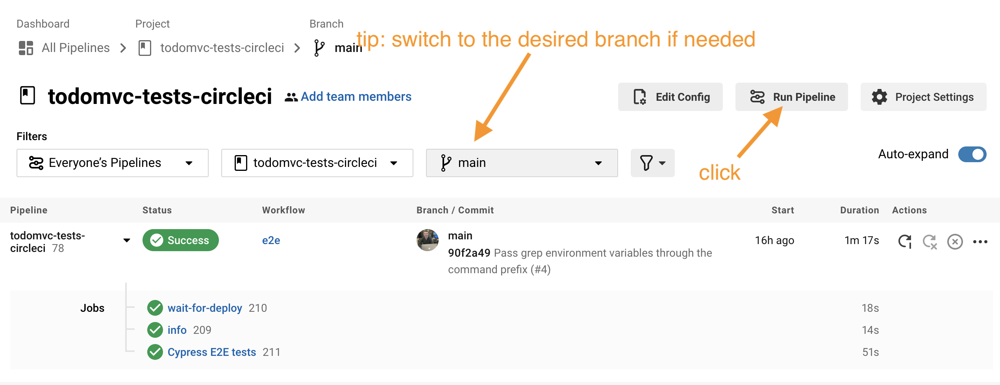
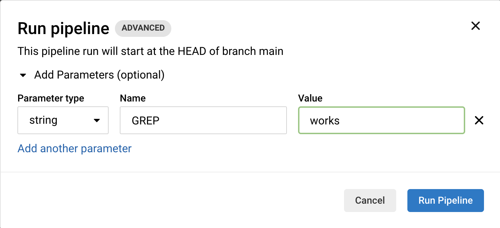
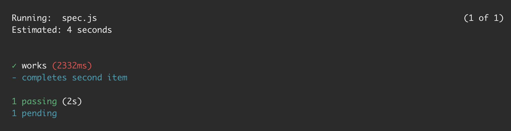

# todomvc-tests-circleci  

> Example E2E tests for an app that lives in a separate repository [bahmutov/todomvc-no-tests-vercel](https://github.com/bahmutov/todomvc-no-tests-vercel)

Read the blog post [How to Keep Cypress Tests in Another Repo While Using CircleCI](https://glebbahmutov.com/blog/how-to-keep-cypress-tests-in-another-repo-with-circleci/)

**Note:** experiments with checking out a specific test branch before running tests, see [bahmutov/circleci-checkout-experiment](https://github.com/bahmutov/circleci-checkout-experiment)

## Running a single test

You can trigger the CircleCI pipeline run and specify a part of the test title to match using [cypress-grep](https://github.com/cypress-io/cypress-grep) plugin.

From the CircleCI web ui click the "Run Pipeline" button

A modal dialog appears. Add a string parameter "GREP" with the part of the test title you want to run.

Click the "Run Pipeline" button. Only that test should execute, while other tests will be marked "pending". See [Cypress test statuses](https://glebbahmutov.com/blog/cypress-test-statuses/)

## Running a single test multiple times in a row

You can "burn" a test by running the CircleCI pipeline with `GREP` and `BURN` parameters, read [Burn Cypress Tests on CircleCI](https://glebbahmutov.com/blog/burn-tests-on-circle/)

## Tagged tests

There are several test tags used in these specs: `@sanity`, `@user`

## Small print

Author: Gleb Bahmutov &copy; 2021

- [@bahmutov](https://twitter.com/bahmutov)
- [glebbahmutov.com](https://glebbahmutov.com)
- [blog](https://glebbahmutov.com/blog/)
- [videos](https://www.youtube.com/glebbahmutov)
- [presentations](https://slides.com/bahmutov)
- [cypress.tips](https://cypress.tips)
